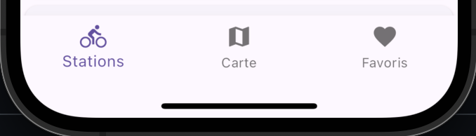
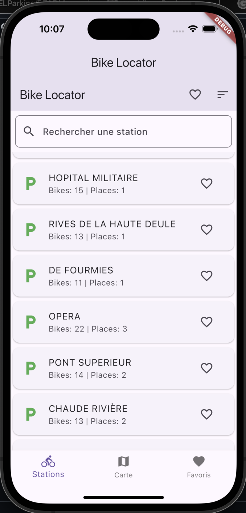

# BikeLocator

**Jalidy Amina, 5A ICy, INSA Hauts-de-France**

Application mobile simple, utilisant le framework Flutter.

Réalisée dans le cadre du cours **Compilation et développement d'applications mobiles** (INSA Hauts-de-France, Spécialité Informatique et Cybersécurité, 5ème année).

Le but était d'utiliser les données ouvertes de la Métropole Européenne de Lille (MEL) pour développer une application permettant aux utilisateurs de trouver et de visualiser les stations de vélos en temps réel. L'application intègre des fonctionnalités de recherche, de tri, et de gestion des favoris.

## Objectifs principaux du projet

- Acquérir des données distantes et fournir des informations actualisées aux utilisateurs.
- Permettre aux utilisateurs de rechercher des stations, de trier la liste selon divers critères, et de gérer leurs lieux et stations favoris.
- Stocker des informations localement (les stations et les lieux favoris de l'utilisateur).

## Interface

![L'interface de l'application est organisée autour de 3 pages, accessibles via des onglets en haut de l'écran. L'utilisateur peut naviguer entre ces onglets :]

L'interface de l'application est organisée autour de 3 pages, accessibles via des onglets en haut de l'écran. L'utilisateur peut naviguer entre ces onglets :

### Onglet "Stations"

L'onglet "Stations" présente la liste des stations de vélos. L'utilisateur peut filtrer cette liste selon des critères spécifiques tels que :

- Afficher uniquement les stations favorites.
- Trier les stations par disponibilité relative.
- Rechercher une station par son nom à l'aide de la barre de recherche.

### Code couleur des stations

Le code couleur pour la disponibilité des stations aide à visualiser rapidement l'état des stations de vélos :

- **Noir** : La station n'a pas de vélos disponibles.
- **Rouge** : La station est presque vide ou pleine (moins de 20% de vélos disponibles).
- **Vert** : La station a une disponibilité optimale (plus de 20% de vélos disponibles).

### Onglet "Carte"

L'onglet "Carte" utilise une carte interactive fournie par OpenStreetMap. Elle affiche les stations de vélos et les lieux favoris de l'utilisateur (lorsqu'ils sont activés via l'icône "œil").

### Affichage des lieux favoris

Lorsqu'un utilisateur appuie sur l'icône "œil", ses lieux favoris sont affichés sur la carte. Un appui sur un lieu favori affiche la liste des stations proches de ce lieu, triées par distance. Pour calculer la distance, l'application utilise la fonction suivante :

Cette fonction utilise la formule de Haversine pour calculer la distance entre deux points géographiques sur la surface de la Terre.

### Onglet "Lieux Favoris"
L'onglet "Lieux Favoris" permet à l'utilisateur d'ajouter et de gérer des lieux fréquents. Ces lieux peuvent être affichés sur la carte pour vérifier rapidement les stations à proximité.

Un glissement vers la gauche permet de supprimer un lieu, et l'utilisateur peut également modifier le nom du lieu. L'ordre de la liste est conservé.

### Fonctionnalités de tri et de réinitialisation

### Dans l'onglet "Stations", l'utilisateur peut utiliser les boutons de tri disponibles :

- Par favoris : Affiche uniquement les stations marquées comme favorites.
- Par disponibilité relative : Trie les stations en fonction de leur ratio vélos/places disponibles, du plus élevé au plus faible.
- L'utilisateur peut réinitialiser la liste en actualisant les données avec un glissement vers le bas (fonctionnalité pull-to-refresh).

### Structure du projet

Le code source de l'application est organisé de la façon suivante :

- main.dart
- models:
  - data_model.dart : Définition du ChangeNotifier qui gère l'état de l'application.
  - bike_station.dart : Représente une station de vélos.
  - place.dart : Représente un lieu favori.
- screens:
  - home_screen.dart : Accueil de l'application avec les onglets.
  - map_screen.dart : Affiche la carte interactive.
  - station_list_screen.dart : Liste les stations disponibles.
  - places_screen.dart : Gère les lieux favoris.
- services:
  - data_service.dart : Récupération des données depuis l'API.
  - geocoding_service.dart : Conversion des adresses en coordonnées géographiques.
- widgets:
  - favorites_button.dart : Bouton de filtrage des favoris.
  - search_bar.dart : Barre de recherche pour filtrer les stations.
  - station_card.dart : Carte représentant une station.
Dépendances

### Les packages utilisés incluent :

provider : Pour gérer l'état de l'application.
geolocator : Pour gérer la localisation de l'utilisateur.
http : Pour les requêtes HTTP vers l'API des stations.
flutter_map et latlong2 : Pour l'affichage des cartes et des coordonnées.
shared_preferences : Pour sauvegarder les données localement.
Implémentation des fonctionnalités

L'état de l'application est géré avec le package provider via un ChangeNotifier. La liste des stations, des lieux favoris et l'état de la localisation de l'utilisateur sont tous contenus dans le DataModel.

Le tri et le filtrage sont effectués en manipulant les listes _stations et _filteredStations, avec des critères de filtrage par nom ou par état de favori. Le code couleur et le calcul de distance sont également gérés dans le DataModel pour simplifier la mise à jour des états.

### Pistes d'amélioration

Fonctionnalités à améliorer
Ajouter un tutoriel explicatif pour l'utilisateur.
Proposer des suggestions lors de l'ajout de lieux favoris.
Améliorer la gestion de la localisation et l'interface de la carte avec des boutons de zoom.
